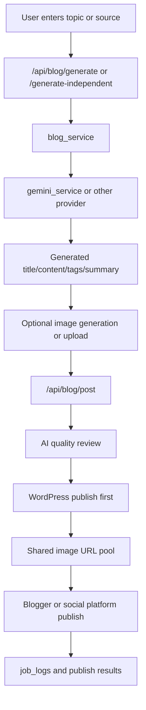
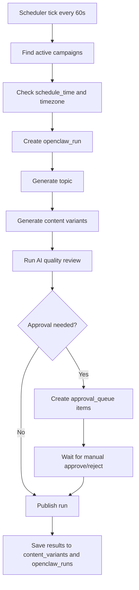

# Blog App Architecture Review

Date: 2026-08-08
Project root: `D:\Projects\BLOG\blog_app`

## 1. Project Summary

This project is a FastAPI-based blog automation system with three major responsibilities:

1. Content generation
   - Generate blog drafts from topics, URLs, YouTube, or uploaded files
   - Translate and enrich content
   - Generate image prompts and image-assisted HTML
2. Publishing
   - Publish to WordPress, Blogger, Facebook, Instagram, TikTok, and Telegram
   - Maintain publish sessions and media state
3. Scheduled automation
   - Run recurring OpenClaw campaigns
   - Review AI output quality
   - Queue approval items and retry failed runs

The current shape is closer to an operations tool than a simple content generator.

## 2. High-Level Runtime Structure

### Entry point

- `main.py`
  - Creates the FastAPI app
  - Mounts static and output directories
  - Registers routers
  - Starts the in-process scheduler on startup
  - Runs `uvicorn` when executed directly

### Main layers

- Web/UI
  - `templates/pages/*.html`
  - `static/js/*.js`
  - `static/css/style.css`
- API routers
  - `app/routers/blog.py`
  - `app/routers/publish.py`
  - `app/routers/openclaw.py`
  - `app/routers/amazon.py`
- Services
  - `services/blog_service.py`
  - `services/publish_service.py`
  - `services/gemini_service.py`
  - `services/openclaw_service.py`
  - `services/scheduler_service.py`
  - `services/social_publish_service.py`
  - `services/source_service.py`
  - `services/ai_quality_service.py`
- Persistence
  - `database.py`
  - `blog_app.db`
- Config and secrets
  - `config.py`
  - `.env`

## 3. Screen Flow

### Pages exposed by `main.py`

- `/`
  - Redirects to `/blog-independent`
- `/blog-independent`
  - Main content generation workspace
  - Topic input, source learning, AI trends, image generation, content editing, publish trigger
- `/settings`
  - API keys, provider settings, Blogger account info, automation settings
- `/logs`
  - Operation logs
- `/publish-hub`
  - Session-based publishing workflow
- `/openclaw-dashboard`
  - Campaign/runs/approval monitoring
- `/amazon-review`
  - Separate Amazon review flow

### Main user journey: blog generation screen

1. User opens `/blog-independent`
2. User optionally adds learning sources
   - URL, YouTube, PDF, TXT, MD
3. User chooses category and enters topic
4. Frontend calls `/api/blog/generate-independent` or `/api/blog/generate`
5. Backend generates localized content through `blog_service`
6. User edits title, tags, summary, and content
7. User optionally generates or uploads images
8. User publishes via `/api/blog/post`

### Publish Hub flow

1. Frontend creates a publish session via `/api/publish/sessions`
2. Session content is analyzed for image insertion points via `/api/publish/analyze-images`
3. Media entries are edited or uploaded
4. HTML is built via `/api/publish/build-html`
5. Content is published via `/api/publish/post-blog`

### OpenClaw dashboard flow

1. User creates or updates campaign via `/api/openclaw/campaigns`
2. Scheduler or manual run triggers campaign execution
3. Dashboard reads `/api/openclaw/dashboard/summary`, `/api/openclaw/runs`, `/api/openclaw/approvals`
4. User approves or rejects pending items if needed

## 4. API Flow

### A. Settings and system APIs

Defined mainly in `main.py`.

- `GET /api/settings/keys`
  - Returns masked key and provider status
- `POST /api/settings/keys`
  - Persists secrets to `.env` and global settings to SQLite
- `GET /api/settings/global`
  - Reads global settings from SQLite
- `POST /api/settings/global`
  - Writes one setting key/value pair
- `GET /api/settings/ai-providers`
  - Lists custom AI providers
- `POST /api/settings/ai-providers`
  - Adds custom provider
- `PUT /api/settings/ai-providers/{provider_id}`
  - Updates provider
- `DELETE /api/settings/ai-providers/{provider_id}`
  - Deletes provider
- `PUT /api/settings/ai-providers/order`
  - Saves built-in provider order
- `GET /api/health`
  - Checks AI, WordPress, Blogger, Telegram health
- `GET /api/settings/social-health`
  - Checks Facebook, Instagram, TikTok connectivity
- `POST /api/language`
  - Changes current app language in-memory

### B. Blog APIs

Defined in `app/routers/blog.py`.

- Blogger accounts
  - `GET /api/blog/accounts`
  - `POST /api/blog/accounts`
  - `PUT /api/blog/accounts/{account_id}`
  - `DELETE /api/blog/accounts/{account_id}`
  - `GET /api/blog/accounts/{account_id}/oauth/start`
  - `GET /api/blog/accounts/{account_id}/status`
- Source extraction
  - `POST /api/blog/extract-source`
  - `POST /api/blog/upload-source-file`
- Content generation
  - `GET /api/blog/trends`
  - `POST /api/blog/auto-process/{project_id}`
  - `POST /api/blog/generate`
  - `POST /api/blog/translate`
  - `POST /api/blog/generate-image-prompt`
  - `POST /api/blog/generate-images`
  - `POST /api/blog/analyze-metadata`
  - `POST /api/blog/generate-independent`
- Publish and logging
  - `POST /api/blog/post`
  - `GET /api/blog/oauth/start`
  - `GET /api/blog/oauth/callback`
  - `GET /api/blog/oauth/status`
  - `GET /api/blog/logs`
  - `GET /api/blog/quality-insights`
  - `POST /api/blog/logs/{log_id}/retry`
  - `POST /api/blog/upload-image`

### C. Publish Hub APIs

Defined in `app/routers/publish.py`.

- Session management
  - `POST /api/publish/sessions`
  - `GET /api/publish/sessions`
  - `GET /api/publish/sessions/{session_id}`
  - `PUT /api/publish/sessions/{session_id}`
  - `DELETE /api/publish/sessions/{session_id}`
- Image and media management
  - `POST /api/publish/analyze-images`
  - `GET /api/publish/sessions/{session_id}/images`
  - `PUT /api/publish/images/{image_id}`
  - `DELETE /api/publish/images/{image_id}`
  - `POST /api/publish/images/{session_id}/add`
  - `POST /api/publish/upload-image/{session_id}/{image_id}`
  - `POST /api/publish/upload-video/{session_id}/{image_id}`
  - `POST /api/publish/upload-image-wp/{session_id}`
  - `POST /api/publish/promote-media/{session_id}`
- HTML and publishing
  - `POST /api/publish/build-html`
  - `POST /api/publish/post-blog`

### D. OpenClaw APIs

Defined in `app/routers/openclaw.py`.

- Campaigns
  - `GET /api/openclaw/campaigns`
  - `POST /api/openclaw/campaigns`
  - `GET /api/openclaw/campaigns/{campaign_id}`
  - `PUT /api/openclaw/campaigns/{campaign_id}`
  - `POST /api/openclaw/campaigns/{campaign_id}/toggle`
  - `POST /api/openclaw/campaigns/{campaign_id}/run`
- Runs and retries
  - `GET /api/openclaw/runs`
  - `GET /api/openclaw/runs/{run_id}`
  - `POST /api/openclaw/runs/{run_id}/retry`
  - `POST /api/openclaw/runs/retry-failed`
- Approvals and dashboard
  - `GET /api/openclaw/approvals`
  - `GET /api/openclaw/dashboard/summary`
  - `POST /api/openclaw/approvals/{approval_id}/approve`
  - `POST /api/openclaw/approvals/{approval_id}/reject`

## 5. Detailed Processing Flows

### A. Topic to published post



Important implementation detail:

- The publish route in `app/routers/blog.py` posts to WordPress first when selected, then reuses public image URLs for other targets.
- This makes WordPress effectively act as a media-hosting base for downstream publishing.

### B. OpenClaw scheduled campaign flow



### C. Source extraction flow

- URL
  - `source_service.extract_from_web`
  - Loads page with `httpx`
  - Parses with BeautifulSoup
  - Removes common boilerplate tags
- YouTube
  - Attempts transcript extraction first
  - Falls back to page metadata extraction
- File
  - PDF via `PyPDF2`
  - TXT/MD via direct file read

## 6. Scheduler Flow

The scheduler is started from FastAPI startup events in `main.py` and implemented in `services/scheduler_service.py`.

### Startup behavior

1. App imports routers and services
2. FastAPI startup event calls `scheduler_service.start()`
3. A background asyncio task starts `_scheduler_loop()`

### Loop behavior

- Interval: 60 seconds
- Work done each cycle:
  - `_run_openclaw_campaigns_if_due()`
  - `_run_legacy_autopost_if_due()`

### OpenClaw campaign scheduling rules

- Reads active campaigns from SQLite
- Skips campaigns already tracked as running in memory
- Skips when DB already has run statuses such as `running`, `waiting_approval`, or `queued`
- Supports daily schedule checks
- Resolves campaign timezone
- Compares current local campaign time against `schedule_time`
- Avoids running more than once per local day using latest run timestamps

### Legacy auto-post rules

- Reads `auto_post_enabled`, `auto_post_time`, and related global settings
- Fetches topic recommendations
- Generates localized platform-specific posts
- Adds images
- Publishes through the same `post_blog` route function

## 7. Data Model Summary

SQLite tables are initialized in `database.py`.

### Core settings

- `global_settings`
- `ai_providers`

### Publishing

- `publish_sessions`
- `publish_images`
- `job_logs`
- `category_templates`
- `ai_quality_reviews`

### Blogger support

- `blogger_accounts`

### OpenClaw automation

- `openclaw_campaigns`
- `openclaw_runs`
- `openclaw_tasks`
- `approval_queue`
- `content_variants`

## 8. Actual Execution Path

### Local development run

Primary command:

```powershell
python main.py
```

Observed runtime path:

1. `config.py` loads `.env`
2. `database.py` initializes schema and loads DB settings into `config`
3. `main.py` creates app and routers
4. Startup event launches scheduler
5. `__main__` block performs startup health check
6. Browser auto-open timer launches `http://127.0.0.1:{PORT}`
7. `uvicorn.run(...)` starts the server

### Important runtime characteristics

- Host defaults to `127.0.0.1`
- Port defaults to `8000`
- `reload=True` only when `DEBUG=true` and not frozen
- Browser auto-open is built in
- Static output is exposed under `/output`

### Packaging clues

- `build_exe.py`
- `SNS_Studio.spec`
- `SNS_Studio_Blog.spec`

These indicate the app is also intended to run as a packaged Windows executable.

## 9. Environment and Configuration

### Required or near-required settings

- AI
  - `GEMINI_API_KEY`
  - `OPENAI_API_KEY`
  - `ANTHROPIC_API_KEY`
  - `AI_TEXT_PROVIDER`
  - `AI_TEXT_MODEL`
- Blogger
  - `BLOG_CLIENT_ID`
  - `BLOG_CLIENT_SECRET`
  - `BLOG_ID`
- WordPress
  - `WP_URL`
  - `WP_USERNAME`
  - `WP_PASSWORD`
- Telegram
  - `TELEGRAM_TOKEN`
  - `TELEGRAM_CHAT_ID`
  - `TELEGRAM_CHANNELS`
- Social
  - `FACEBOOK_PAGE_ID`
  - `FACEBOOK_ACCESS_TOKEN`
  - `INSTAGRAM_ACCOUNT_ID`
  - `INSTAGRAM_ACCESS_TOKEN`
  - `TIKTOK_ACCESS_TOKEN`

### Config storage model

This project uses a mixed configuration model:

- `.env`
  - Source of initial config
  - Updated directly for some key values
- `global_settings` table
  - Stores mutable runtime settings
- `config` class
  - In-memory effective settings after DB load

## 10. Test Status and How To Test

### Current automated test status

- `tests/` directory exists but currently appears empty
- No discovered `pytest` tests
- No visible `FastAPI TestClient` usage
- No visible integration test harness

Current conclusion:

- There is effectively no active automated test coverage in this workspace snapshot

### Recommended local smoke test sequence

1. Install dependencies

```powershell
pip install -r requirements.txt
```

2. Start app

```powershell
python main.py
```

3. Verify health endpoints

```powershell
Invoke-WebRequest -Uri http://127.0.0.1:8000/api/health -UseBasicParsing
Invoke-WebRequest -Uri http://127.0.0.1:8000/api/settings/keys -UseBasicParsing
Invoke-WebRequest -Uri http://127.0.0.1:8000/api/openclaw/dashboard/summary -UseBasicParsing
```

4. Manual UI checks

- `/blog-independent`
  - Topic input renders
  - Trend chip load works
  - Generation request returns content
- `/settings`
  - Saved keys/status load
  - Blogger accounts list renders
- `/publish-hub`
  - Session creation works
  - Image analysis works
- `/openclaw-dashboard`
  - Campaign list and runs load

5. Manual API checks

- Source extraction
  - `POST /api/blog/extract-source`
- Multi-language generation
  - `POST /api/blog/generate-independent`
- HTML build
  - `POST /api/publish/build-html`
- Manual publish
  - `POST /api/blog/post`
- Campaign run
  - `POST /api/openclaw/campaigns/{id}/run`

### Recommended minimum automated test plan

Priority 1:

- `database.py`
  - schema init
  - CRUD for campaigns, runs, variants
- `publish_service.build_blog_html`
  - placeholder replacement
  - paragraph insertion
  - HTML passthrough behavior
- `ai_quality_service`
  - score fallback behavior
  - tag sanitization
- request validation
  - `/api/blog/post`
  - `/api/publish/build-html`

Priority 2:

- scheduler due-time calculations
- OpenClaw campaign state transitions
- source extraction fallbacks with mocked HTTP

Priority 3:

- WordPress/Blogger/social adapter integration tests with mocked responses

## 11. Structure Review: Major Risks

### P1. Router layer and service layer are tightly coupled

Examples:

- `services/scheduler_service.py` imports `BlogPostRequest` and `post_blog` from `app/routers/blog.py`
- `services/openclaw_service.py` also imports `BlogPostRequest` and `post_blog`

Why this is risky:

- Background jobs depend on HTTP-layer code instead of a pure publishing service
- Testing gets harder because service behavior requires router imports
- Refactoring request models can break scheduler/runtime behavior unexpectedly

Recommendation:

- Move publish orchestration into a service method such as `publish_service.publish_multi_target(...)`
- Let routers translate HTTP payloads into service calls
- Let scheduler/OpenClaw call service methods directly

### P1. Configuration has side effects during import

Examples:

- `database.py` runs `init_db()` at import time
- `database.py` runs `load_settings_to_config()` at import time

Why this is risky:

- Importing a module changes DB state and process config immediately
- Test isolation becomes harder
- Startup order bugs become subtle and environment-dependent

Recommendation:

- Make initialization explicit in app startup
- Keep imports side-effect free where possible

### P1. Publishing security for WordPress verification is weakened

Example:

- `services/blog_service.py` uses `httpx.AsyncClient(..., verify=False)` for WordPress requests

Why this is risky:

- TLS verification is disabled
- A bad certificate or interception problem can be masked
- Production publishing may silently accept unsafe connections

Recommendation:

- Remove `verify=False`
- If self-signed certs are unavoidable, make that a controlled opt-in config

### P1. No effective automated test coverage

Observed state:

- Empty `tests/`
- No discovered automated test code

Why this is risky:

- High regression risk for a stateful system with multiple external integrations
- Hard to safely refactor publish flow, scheduler logic, or content assembly

Recommendation:

- Add focused unit tests before major refactors
- Start with deterministic functions and scheduler logic

### P2. In-process scheduler design limits operational safety

Examples:

- Scheduler runs inside the FastAPI process
- Timing and job state depend on one app instance

Why this is risky:

- If the web process restarts, scheduled work pauses
- If deployment ever uses multiple workers or multiple instances, duplicate-run protection becomes fragile
- Long-running background jobs compete with request handling

Recommendation:

- Separate scheduler/worker process from web app, or at least isolate job execution from request app lifecycle

### P2. Mixed config sources increase drift risk

Examples:

- `.env`
- SQLite `global_settings`
- in-memory `config`

Why this is risky:

- Effective values can differ by write path
- Debugging “what config is actually active” becomes slower
- Secret rotation and environment portability become harder

Recommendation:

- Define one source of truth for mutable settings
- Add a clear precedence rule and document it in code

### P2. File and temp path handling is inconsistent

Examples:

- `temp_sources`
- `temp_uploads`
- direct relative path writes

Why this is risky:

- Runtime behavior depends on current working directory
- Cleanup can be incomplete
- Packaged app behavior may differ from dev behavior

Recommendation:

- Centralize temp/output path creation in `config.py`
- Use absolute paths derived from app base dir

### P2. Encoding issues are already visible in source and docs

Observed state:

- README and several strings/comments render as mojibake in this environment snapshot

Why this is risky:

- Harder maintenance
- Risk of broken UI labels, logs, or prompt text
- Review/debugging productivity drops

Recommendation:

- Standardize UTF-8 across source, templates, and docs
- Audit files with broken encodings first

## 12. Suggested Improvement Priority

### Immediate

1. Add automated tests for publish HTML assembly, scheduler date logic, and DB CRUD
2. Extract router-independent publish orchestration service
3. Remove or gate `verify=False`
4. Normalize file encoding to UTF-8

### Near-term

1. Refactor startup and config initialization to avoid import-time side effects
2. Centralize temp/output path management
3. Document config precedence and secret storage rules

### Later

1. Split scheduler/worker from web process
2. Add integration-test stubs for external platforms
3. Introduce structured logging and metrics for campaign runs

## 13. Recommended Next Engineering Tasks

If continuing from this review, the best sequence is:

1. Add a small test harness with `pytest`
2. Write tests for `publish_service.build_blog_html`
3. Extract a service-level `publish_run` or `publish_multi_target` API
4. Move scheduler/OpenClaw to that service API
5. Clean up encoding issues in docs/templates/messages

